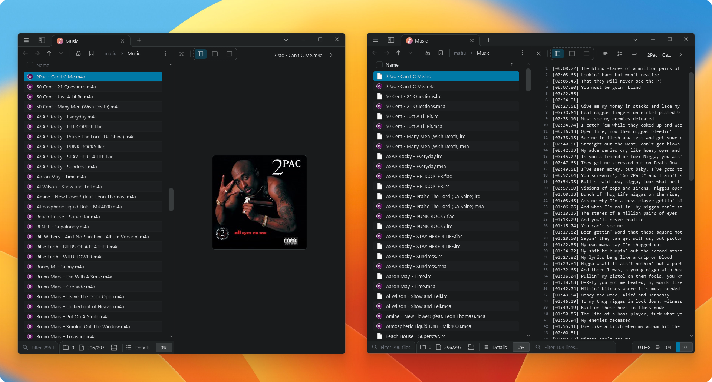
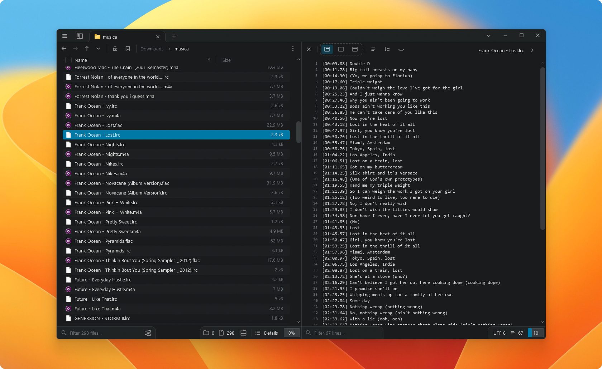

# LocalLyricsSync

A command-line tool that scans your local music library and downloads synchronized lyrics (`.lrc`) for each track, using the public database from [lrclib.net](https://lrclib.net).

## Description

LocalLyricsSync walks through a folder of your music, reads each file's metadata (artist, title, album, duration), and looks up its synchronized lyrics on lrclib.net. When a match is found, it saves an `.lrc` file next to the track, ready for any compatible player to display in real time.

The whole process runs in parallel and keeps a local record of what has already been processed, so you can run it again on the same library without reprocessing tracks that already have lyrics.

## Features

- Recursive library scanning: `.mp3`, `.flac`, `.m4a`, `.ogg`, `.opus`, `.wav`
- Exact-match search on lrclib.net, with an automatic fuzzy-search fallback when the first attempt finds nothing
- Local SQLite cache: already-processed tracks are not queried again on future runs
- Parallel processing with a configurable number of threads
- Per-file error handling: if one track fails (corrupted metadata, network error, etc.) it does not interrupt the rest of the process

<br>

<div align="center">
  
https://github.com/user-attachments/assets/44614325-74d2-47e2-a26c-46201285d6e9




</div>

## Requirements

- Python 3.9 or higher
- Dependencies listed in `requirements.txt`:
  - `mutagen`
  - `requests`
  - `tqdm`

## Installation

### Option 1: download the latest release

1. Go to the [Releases](../../releases) section and download the latest version.
2. Extract the contents to a folder of your choice.
3. Install the dependencies:

   ```
   pip install -r requirements.txt
   ```

### Option 2: clone the repository

```
git clone https://github.com/Mati-mlttn/LocalLyricsSync.git
cd LocalLyricsSync
pip install -r requirements.txt
```

## Usage

```
python main.py <path_to_your_library>
```

### Available options

| Option            | Description                              | Default     |
| ----------------- | ---------------------------------------- | ----------- |
| `library`         | Path to your music folder (required)     | -           |
| `-t`, `--threads` | Number of threads to run in parallel     | `8`         |
| `--db`            | SQLite database file used for caching    | `lyrics.db` |
| `--force`         | Reprocess tracks that are already cached | disabled    |

### Examples

Scan a library with the default settings:

```
python main.py C:\Users\username\Music
```

Use fewer threads, useful on slower connections or more limited machines:

```
python main.py /home/username/Music --threads 4
```

Force reprocessing of every track, including already-cached ones:

```
python main.py /home/username/Music --force
```

## How it works

1. Scans the given folder and detects supported audio files.
2. Reads artist, title, album, and duration from each file using `mutagen`.
3. Looks up synchronized lyrics on lrclib.net: first an exact match, and if that finds nothing, a fuzzy search by title, artist, and album, picking the result whose duration is closest to the local file's.
4. If synchronized lyrics are found, saves them as an `.lrc` file next to the track.
5. Records the result (found, not found, error) in a local SQLite database, so that track is not queried again on future runs unless `--force` is used.

## Supported audio formats

`.mp3` · `.flac` · `.m4a` · `.ogg` · `.opus` · `.wav`

## Credits

This project uses the public API from [lrclib.net](https://lrclib.net) to retrieve synchronized lyrics.
